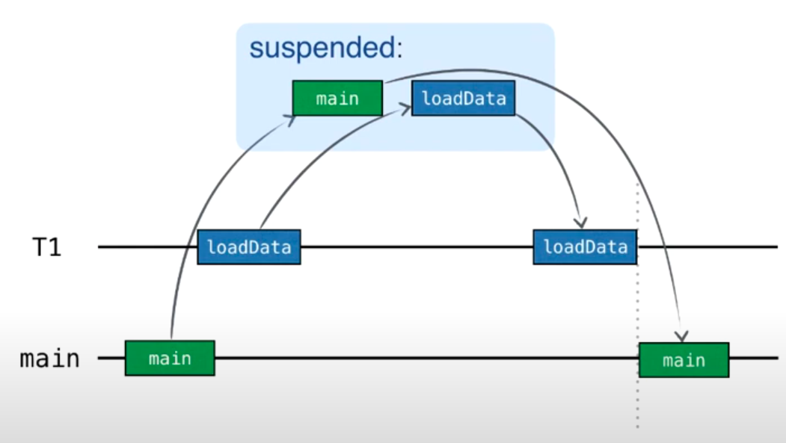
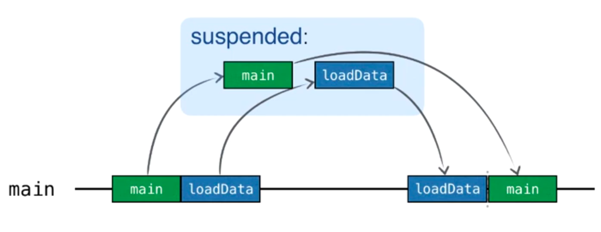

[](https://confluence.jetbrains.com/display/ALL/JetBrains+on+GitHub)
[](https://www.apache.org/licenses/LICENSE-2.0)

# Introduction to Coroutines and Channels Hands-On Lab

This repository is the code corresponding to the
[Introduction to Coroutines and Channels](https://play.kotlinlang.org/hands-on/Introduction%20to%20Coroutines%20and%20Channels/01_Introduction)
Hands-On Lab.

## Concurrency sample

```kotlin
fun main() = runBlocking {
    val deferred: Deferred<Int> = async(Dispatchers.Default) {
        loadData()
    }
    log("waiting...")
    log(deferred.await())
}

suspend fun loadData(): Int {
    log("loading...")
    delay(1000L)
    log("loaded!")
    return 42
}
```

1. main coroutine is created on Main thread (`runBlocking`)
2. loadData coroutine is created on Different thread (`async(Dispatchers.Default)`)
3. log 'waiting' (main) and log 'loading' (loadData) are executed simultaneously (no guarantee which one is first)
4. main (`await()`) and loadData (`delay`) suspend simultaneously and release their threads free (no guarantee which one
   is first)
5. loadData resumes after 1s, logs 'loaded' and finishes with value 42 (coroutine is finished)
6. finish of loadData coroutine resumes main coroutine, main coroutine prints 42 and finishes as well



When async creates coroutine on the same thread:

```kotlin
val deferred: Deferred<Int> = async { loadData() }
```

1. main coroutine is created on Main thread (`runBlocking`)
2. loadData coroutine is created on SAME Main thread (`async`)
3. log 'waiting' from main coroutine (we can't switch to loadData yet, we are busy with main)
4. main (`await`) is suspended and main thread is free
5. loadData coroutine starts execution, prints 'loading', suspends for 1s, finishes with 42
6. releases main thread and resumes main coroutine, main coroutine prints 42 and finishes as well



### Inheriting the context by default

With structured concurrency, you can specify the major context elements (like dispatcher) once, when creating the
top-level coroutine. All the nested coroutines then inherit the context and modify it only if needed.